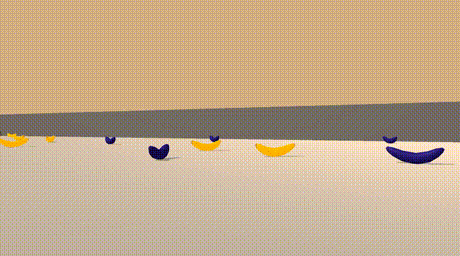

# Unity Banana Collector

## Environment
<p align="center">
  
</p>
A reward of +1 is provided for collecting a yellow banana, and a reward of -1 is provided for collecting a blue banana.  Thus, the goal of agent is to collect as many yellow bananas as possible while avoiding blue bananas.  

The state space has 37 dimensions and contains the agent's velocity, along with ray-based perception of objects around agent's forward direction.  Given this information, the agent has to learn how to best select actions.  Four discrete actions are available, corresponding to:
- **`0`** - move forward.
- **`1`** - move backward.
- **`2`** - turn left.
- **`3`** - turn right.

The task is episodic, and in order to solve the environment, your agent must get an average score of +13 over 100 consecutive episodes.

## Installation
0. Clone the repository
    ```bash
    git clone https://github.com/torayeff/drl-codes.git
    cd drl-codes/banana-collector/
    ```
    
1. Create and activate an environment:

    ```bash
    conda create --name banana-collector python=3.6
    conda activate banana-collector
    ```
    
2. Install dependencies:
    ```bash
    cd python/
    pip install .
    ```

3. Download Unity environment [(Udacity-specific)](https://github.com/udacity/deep-reinforcement-learning/tree/master/p1_navigation) and decompress it in the `banana-collector/` directory:
    - Linux: [click here](https://s3-us-west-1.amazonaws.com/udacity-drlnd/P1/Banana/Banana_Linux.zip)
    - Mac OSX: [click here](https://s3-us-west-1.amazonaws.com/udacity-drlnd/P1/Banana/Banana.app.zip)
    - Windows (32-bit): [click here](https://s3-us-west-1.amazonaws.com/udacity-drlnd/P1/Banana/Banana_Windows_x86.zip)
    - Windows (64-bit): [click here](https://s3-us-west-1.amazonaws.com/udacity-drlnd/P1/Banana/Banana_Windows_x86_64.zip)

## Training and Evaluation
Training: 

```python training.py```

Evaluation:

```python evaluate.py```