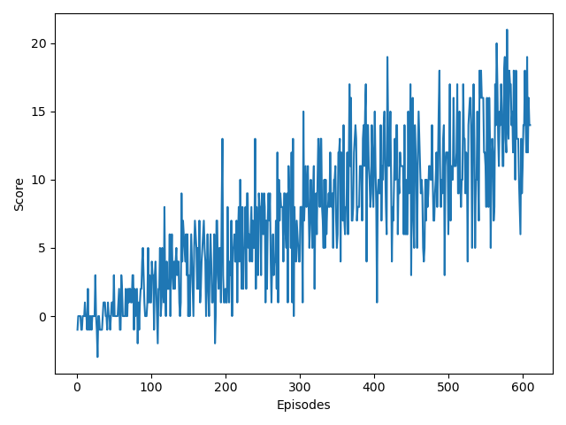

# Report

## Learning Algorithm

For this task, I have implemented a [DQN algorithm](https://www.cs.toronto.edu/~vmnih/docs/dqn.pdf). 
The implemented agent has two similar Q-Networks which is kept fixed and updated after some iterations.
Q-Network is a simple feedforward neural network with three layers where the input is a 37-dimensional state vector. 
The next layer has 64 hidden units with ReLU activation function. Then another hidden layer with 64 hidden units with ReLU activation function is used. 
The output layer has 4 output units, i.e. the number of actions and no activation function is used after the output layer. 
The output layer gives the action-values for each of the 4 actions. 
The crucial part of the implemented agent is the replay buffer which is implemented as a double-ended queue. 
Replay buffer is used to store the experiences. During the training of the network, experiences are sampled from the replay buffer. 
Adam optimizer is used for the optimizing of the network parameters.

## Hyperparameters
- `buffer_size = 1e4`
- `batch_size = 32`
- `gamma = 0.99`: discount rate.
- `tau = 1e-3`: for the soft update of Q-Network parameters.
- `lr = 1e-3`: learning rate.
- `update_every = 2`: for updating network parameters.

## Plot
The task is considered solved when the agent gets an average score of +13 over 100 consecutive episodes.
`buffer_size = 1e4` and `update_every = 2` hyperaparameters allowed me to solve the task in 500+ episodes. Training was done completely on CPU.

## Future Work
Implement [Rainbow](https://arxiv.org/abs/1710.02298) algorithm and verify the effectiveness of the proposed approaches.

